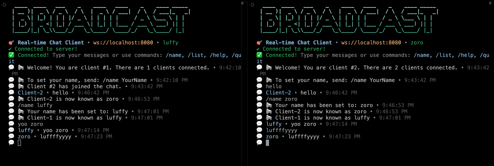

# Broadcast Server - Real-time Chat Application

A feature-rich WebSocket broadcast server for real-time messaging with support for client names, commands, and multiple concurrent users.



## 🚀 Features

- **Real-time messaging** - Instant message broadcasting to all connected clients
- **Client names** - Set custom display names with `/name` command
- **Interactive commands** - Built-in commands for chat management
- **Multiple clients** - Support for unlimited concurrent connections
- **Beautiful CLI interface** - Colored output with emojis and formatting
- **Cross-platform** - Works on Windows, macOS, and Linux

## 📋 Prerequisites

- **Node.js** (v14 or higher) - Download from [nodejs.org](https://nodejs.org)
- **npm** (comes with Node.js)

## 🛠️ Local Development Setup

### 1. Clone or Download the Project

```bash
# If you have the files locally, navigate to the project directory
cd broadcast-server
```

### 2. Install Dependencies

```bash
npm install
```

### 3. Start the Server

```bash
# Start server on default port 8080
npm start

# Or use the CLI directly
node index.js start

# Custom port and host
node index.js start --port 3000 --host 0.0.0.0
```

### 4. Connect as a Client

Open a new terminal window and connect as a client:

```bash
# Connect to local server
node index.js connect

# Connect with custom name
node index.js connect --name "YourName"

# Connect to specific host/port
node index.js connect --host localhost --port 8080 --name "YourName"
```

### 5. Alternative: Use the Simple Join Script

For easier client connection:

```bash
# Edit join-chat.js to point to your local server
# Change SERVER_URL to: "ws://localhost:8080"

# Then run:
node join-chat.js "YourName"
```

## 🌐 Deployment Instructions

### Deploy to Railway (Recommended)

1. **Create Railway Account**
   - Go to [railway.app](https://railway.app)
   - Sign up with GitHub

2. **Deploy the Project**
   ```bash
   # Install Railway CLI
   npm install -g @railway/cli
   
   # Login to Railway
   railway login
   
   # Initialize and deploy
   railway init
   railway up
   ```

3. **Configure Environment**
   - Railway will automatically detect the Node.js project
   - The `Procfile` and `railway.json` are already configured
   - Set the start command: `node index.js start --port $PORT --host 0.0.0.0`

### Deploy to Heroku

1. **Create Heroku App**
   ```bash
   # Install Heroku CLI
   # Create app on heroku.com
   
   # Deploy
   git push heroku main
   ```

2. **Configure Procfile**
   ```
   web: node index.js start --port $PORT --host 0.0.0.0
   ```

### Deploy to Vercel

1. **Create vercel.json**
   ```json
   {
     "version": 2,
     "builds": [
       {
         "src": "index.js",
         "use": "@vercel/node"
       }
     ],
     "routes": [
       {
         "src": "/(.*)",
         "dest": "/index.js"
       }
     ]
   }
   ```

2. **Deploy**
   ```bash
   npm install -g vercel
   vercel
   ```

## 🎯 Usage Guide

### Server Commands

```bash
# Start server with default settings
node index.js start

# Start on custom port
node index.js start --port 3000

# Start on all interfaces (for deployment)
node index.js start --host 0.0.0.0 --port $PORT
```

### Client Commands

```bash
# Connect to server
node index.js connect

# Connect with name
node index.js connect --name "Alice"

# Connect to deployed server
node index.js connect --host your-app.railway.app --port 443 --name "Bob"
```

### Chat Commands (Once Connected)

- `/name YourName` - Set your display name
- `/list` - Show all connected users
- `/help` - Show available commands
- `/quit` - Disconnect from server

## 📱 Example Chat Session

```
🎯 Real-time WebSocket Broadcast Server • Feature-rich chat with client names and commands

💬 Welcome! You are client #1. There are 1 clients connected.
💬 To set your name, send: /name YourName

/name Alice
📢 Your name has been set to: Alice

Hello everyone!
Alice • Hello everyone! • 14:30:15

Client #2 has joined the chat.
Client-2 • Hi Alice! • 14:31:20

/name Bob
📢 Client-2 is now known as Bob

Bob • Nice to meet you! • 14:31:45
```

## 🔧 Configuration

### Environment Variables

- `PORT` - Server port (default: 8080)
- `HOST` - Server host (default: localhost)

### Custom Server Settings

Edit `server.js` to modify:
- Message format
- Client timeout settings
- Maximum connections
- Custom commands

## 🆘 Troubleshooting

### Common Issues

**"Connection refused"**
- Server might not be running
- Check if port is available
- Verify host/port settings

**"Module not found"**
- Run `npm install` to install dependencies
- Check Node.js version (v14+ required)

**"Permission denied"**
- Make sure Node.js is installed correctly
- Check file permissions

**"WebSocket connection failed"**
- Verify server is running
- Check firewall settings
- Ensure correct protocol (ws:// for local, wss:// for deployed)

### Debug Mode

```bash
# Enable debug logging
DEBUG=* node index.js start
```

## 📁 Project Structure

```
broadcast-server/
├── index.js          # Main CLI application
├── server.js         # WebSocket server implementation
├── client.js         # Client connection logic
├── join-chat.js      # Simple client connection script
├── package.json      # Dependencies and scripts
├── Procfile          # Railway deployment config
├── railway.json      # Railway specific settings
└── README.md         # This file
```

## 🤝 Contributing

1. Fork the repository
2. Create a feature branch
3. Make your changes
4. Test locally
5. Submit a pull request

## 📄 License

MIT License - feel free to use this project for personal or commercial purposes.

## 🎉 Happy Chatting!

Connect with friends, family, or colleagues using this real-time chat application. The simple setup and deployment options make it perfect for quick communication needs.

---

**Need help?** Check the troubleshooting section above or create an issue in the repository. 